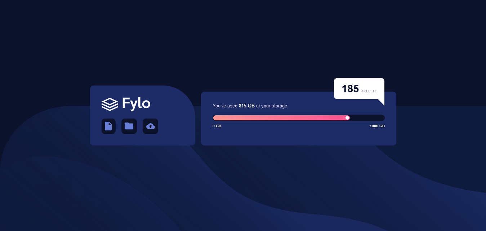
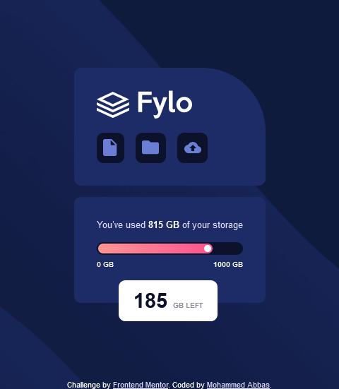

# Frontend Mentor - Fylo data storage component solution

This is a solution to the [Fylo data storage component challenge on Frontend Mentor](https://www.frontendmentor.io/challenges/fylo-data-storage-component-1dZPRbV5n). Frontend Mentor challenges help you improve your coding skills by building realistic projects. 

## Table of contents

- [Overview](#overview)
  - [The challenge](#the-challenge)
  - [Screenshot](#screenshot)
- [My process](#my-process)
  - [Built with](#built-with)
  - [What I learned](#what-i-learned)
  - [Useful resources](#useful-resources)
- [Author](#author)
- [Acknowledgments](#acknowledgments)

## Overview

### The challenge

Users should be able to:

- View the optimal layout for the site depending on their device's screen size

### Screenshot

## My process

### Built with

- Semantic HTML5 markup
- CSS custom properties
- Flexbox
- CSS Grid
- Mobile-first workflow

### What I learned

I learnt just a little about clip-path property in CSS that allow you to create complex shape.

### Useful resources

- [clip-path generator](https://bennettfeely.com/clippy/) - This helped me for generate triangle shape. this website so useful will help you to generate complex shape using clip-path property

## Author

- Frontend Mentor - [@mohammedabbas7](https://www.frontendmentor.io/profile/Mohammedabbas7)
- Twitter - [@Mohamme48222268e](https://twitter.com/Mohamme48222268)